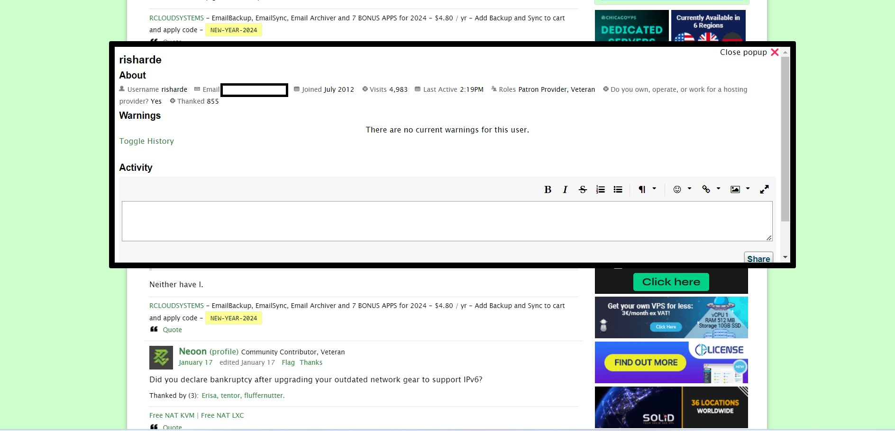

LET PROFILE VIEWER

These chrome and firefox extensions simply allows you to click the profile link next to the username
in a post to get the user details without going to the next page and then having to press back to 
to return to the thread you were reading. 

2 versions available - Chrome and Firefox

FIREFOX INSTALL INSTRUCTIONS
1. Clone or Download the firefox directory to a directory on your machine
2. Open your Firefox to url: about:debugging
3. Click on the left side 'This Firefox'
4. Click 'Load temporary addon'
5. Choose the manifest.json file from the firefox directory you downloaded.

CHROME INSTALL INSTRUCTIONS
1. Clone or Download the chrome directory to a directory on your machine
2. Open your Chrome to url: chrome://extensions
3. Click on the 'Load unpacked' button
4. Choose the directory you downloaded the files to.

Now head over to LET, refresh the site and avoid an extra click
Save the wear and tear of your mouse! j/k.

THE LICENSE IS FREE WITH ATTRIBUTION REQUIRED THIS TIME IF YOU WANT TO FORK AND MAKE CHANGES.
AUTHOR: Risharde (RCLOUDSYSTEMS.COM)

SINCE I WILL MAINTAIN THIS FOR MY OWN USE - NO PRs asking me to change jQuery - it's too easy for me.
